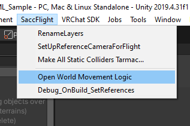
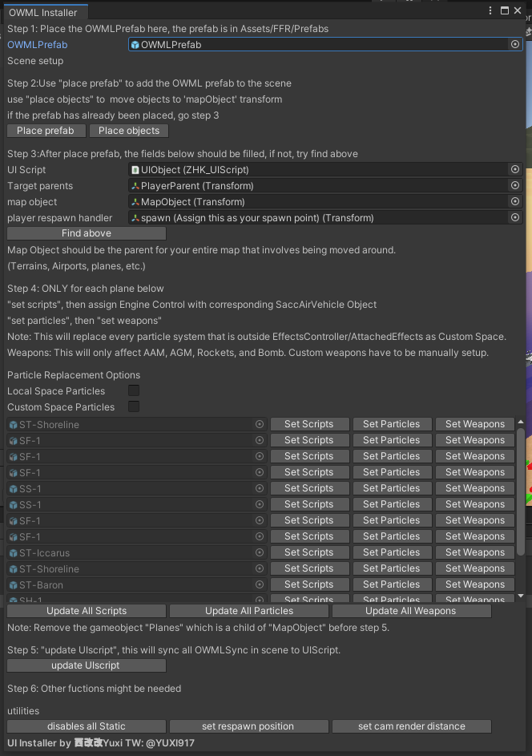
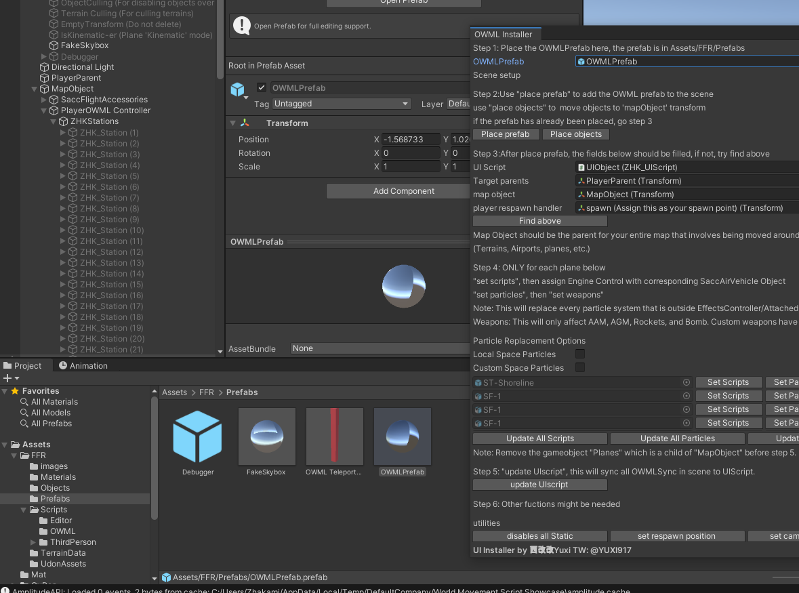
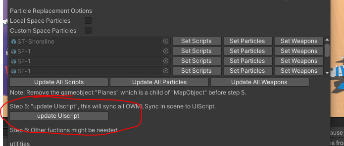
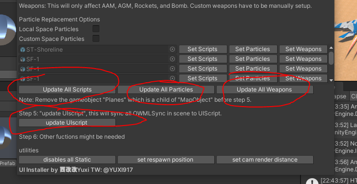
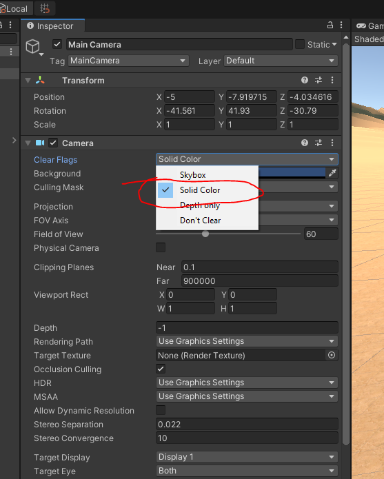
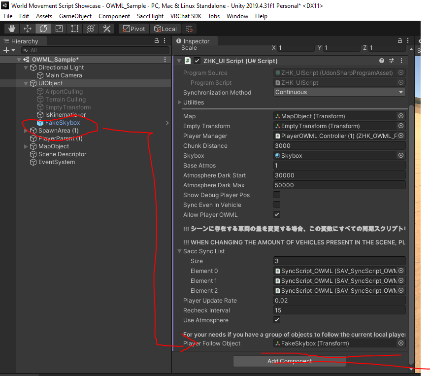

# ZHK DLC - Open World Movement Logic Package Extension for SaccFlight.

Twitter: [@ZZhako](https://twitter.com/ZZhako)

Discord: ZhakamiZhako#2147

VRC: Zhakami Zhako

With collaboration of [YUXI](https://github.com/Heriyadi235)

More extensions will come in the future! you may support me through and / or booth

https://ko-fi.com/zhakamizhako
https://zzhako.booth.pm/

Any concerns, please feel free to contact me or head to my discord under #OWML-talk or #OWML-support
https://discord.gg/kjPhHSfUDY


# IMPORTANT
**BACKUP YOUR PROJECTS**

Before using this system; Note the downsides.

Please note the following:
>	- You will not be able to use Static Batching.
>	- Avatar bones will go crazy when walking in **vast** terrain
>	- VRC Object Sync'd objects will only synchronize in World Space
>	- When using QVPens, it will not synchronize properly when you've already crossed a chunk.

You will probably need to:
>	- Optimize without Static objects
>	- Remove the 'static' option on affected objects
>	- Optimize using LODs
>	- Use the ZHK_ModifiedObjectSync Script to Synchronize objects in Map Space
>	- Make small colliders on parts where you are expected to walk.
>	- Use the included modified Object Sync
>	- QVPen usage may only work best near the spawn for now. Try not to cross the first chunk.

Notes
>	- When creating an aircraft, uncheck repeating world in the SaccAirVehicle.

# Changelog 
```
(v1.3)
- Adaptation for SaccFlight 1.61, updated Sync Script for 1.61
- Added Debugger - Press CTRL + ALT + O to toggle the debugger, pageup/pagedown to scroll through
- Improved Ground player OWML, Player Station Assignment
- Optimization on Player Stations
- Added Station Timeout to auto-disable ZHK_Stations that aren't being used.
- Added Recheck Interval to resynchronize players that are not in their 'proper' stations
- Added OWML distance Slider
- Added automatic Kinematic Checker in UIScript
- Added Altitude Animator for Atmosphere detection
- Added YUXI's Easy UI Installer for OWML
- Planes will be automatically disabled during upload mode (Will not affect actual world; This is for performance optimization during upload time since all vehicles will be active)
- Changed the "ZHK_ModifiedObjectSync" to use 'Continuous' instead of manual sync
- 

(v1.2)
- Adaption for SaccFlight 1.6, added namespace changes
- Added support for SaccGroundVehicles
- Added Debugger when enabling Debug Player Pos in UIScript
- Added Project fairy Logo
- Added fake skybox template


(v1.1)
- Improved ground player OWML
- Improved handler when a certain player has not been assigned a station
- Updated for UdonSharp v1.0b, VRCSDK3-WORLD-2022.06.03.00.03_Public, Sacchan Flight and Vehicles commit id 97252921158388ace978797e374cda42974ebd48

(v1.0)

- Converted OWML from Project Fairy
- Implemented OWML using Chunks
- Added customization on the Chunk distance on UI Script
- Removed references of the old code from Project Fairy
- Added OWML_Player (Player Management)
- Added OWML_Station (Per Player station manager & Synchronization)
- Improved Respawn Handler
```
# What is OWML?
**O**pen **W**orld **M**ovement **L**ogic is an extension for Sacc Flight and Vehicles that allows you to travel further than the usual limitations of VRChat. An ordinary SaccFlight map can only handle up to 40km x 40km from the center of the map all the way to the edge and everything will start to jitter.

OWML overcomes this by using a certain implementation called **origin point shifting**. ([Reference](https://www.youtube.com/watch?v=mXTxQko-JH0&t=5s))

How it works is basically moving the map hierarchy as you cross the certain distance limit, shifting you back and teleporting the map according to the distance you have travelled while in the background, the synchronization does its job.

How the player synchronization works is it needs a player manager, a VRC Station to each player, and a controller on each VRCStation in order to adapt and synchronize each player according to their offset of their current position and the map.

Aircraft synchronization also is dependent on how far it is based on the map offset as well.

Other features covering outside SaccFlight may come in the future.

# SETUP

## STEPS TO SETUP WORLD WITH OWML

REQUIREMENTS:

- VRCSDK3-WORLD-2022.06.03.00.03_Public or onwards (https://vrchat.com/home/download)
- Requires Udonsharp from the CreatorCompanion.  (Download via https://vrchat.com/home/download)
- CyanEmu or VRChat Client Simulator 1.1.3 (Check Creator Companion)
- SaccFlight 1.6 or ownards (https://github.com/Sacchan-VRC/SaccFlightAndVehicles)
- OWML (Get from releases, https://github.com/zhakamizhako/VRCOpenWorldMovementLogic/releases)
	
	
We'll assume that you've already downloaded the latest SDK, setup the world requirements (Scene descriptor, setting up SaccFlight 1.6, etc.) up to being able to setup and fly the aircraft in Unity with the **VRChat Client Simulator 1.1.3 or onwards.**. 

**I cannot guarantee that this will work for older versions. If you want to try, please backup your project beforehand.**

You can integrate the system in a few ways
- A. Use the Installer (Highly Recommended)
- B. Use the prefab in Assets/FFR/OWML
- C. Load OWML_Sample Scene file
- D. Make from scratch. (If you want to, but i highly suggest not to.)

## A. USING THE INSTALLER

The new UI Installer (thanks YUXI!) is the most preferrable way in order to setup your scene with existing and new aircrafts; as well as an existing and new scenes; Since this will save you the hassle of setting up each and every single aircraft and scene(s). As you use it, you may still refer to the guides below when troubleshooting.

If you are setting up for a new aircraft, it is highly recommended that you setup this aircraft in flying order first before implementing OWML into it.

1. Make sure that the scene is in flying order.

2. Access the Open World Movement Logic UI Menu through the Menu Bar -> SaccFlight -> Open World Movement Logic



#### Existing Scenes without OWML

1. Import OWMLPrefab from Assets/FFR/OWML into the UI Installer

2. Click 'Place Prefab' to automatically place the prefab in the correct hierarchy
3. Click 'Place Objects' to automatically setup the hierarchy order/objects. 
	- This will move any 'map' related objects inside MapObject. Planes, Terrains, etc.
	- This is not supposed to break your hierarchy order. If it does, please contact me.
4. The 'Step 3' in the UI Installer should be automatically be filled. If not, you may hit 'Find Above' to automatically repopulate the list; Else, you may manually assign it.
5. The aircraft list will automatically update as it sees new, added and removed vehicles. Vehicle setup can be automatically setup by clicking "Update All Scripts", "Update All Particles", "Update All Weapons" buttons respectively.


- "Update All Scripts" or "Set Scripts" will do the following order:
	- Creating an OWMLScript
	- Creating a SAV_SyncScript_OWML, referencing OWML; Disabling the old SAV_SyncScript
	- Create a HUDController_OWML, referencing the old HUDController; Disabling the old HUDController
	- Updates the Extension Behaviours in the SaccEntity
- Update Particles or Set Particles will do the following
	- Set each "World" particle to "Custom Space" with MapObject as reference.
	- If 'Local Space Particles' and/or 'Custom Space Particles' are included, it will be updated as well.
	- This will only affect each vehicle.
- "Update All Weapons" or "Set Weapons" will do the following order:
	- Update each **DFUNC_AAM** to have World Parent set to **MapObject**
	- Update each **DFUNC_AGM** to have World Parent set to **MapObject**
	- Update each **DFUNC_Bomb** to have World Parent set to **MapObject**
	- Update each **DFUNC_Rocket** to have World Parent set to **MapObject**
- Weapons covered are DFUNC_AAM, DFUNC_AGM, DFUNC_Rocket, DFUNC_Bomb
- DFUNC_Gun are covered in 'Update All Particles'
- Custom weapons may need to be manually setup. General rule here is any 'World' space particles should be in 'Custom' and is set to 'MapObject'. Any projectiles must be spawned inside MapObject.
7. Update the UIScript by clicking **Update UIScript** Button in the UI.



8. Automatically disable static objects by clicking 'Disable All Static'
	- This will uncheck every single static object in the scene.
	- OWML will not work properly with static batching since this works as a floating origin. Enabling it may result of object(s) looping through the scene.
9. Automatically set the respawn position of your VRC Scene Descriptor by clicking "Set Respawn Position"
	- This will set the VRC Scene Descriptor's respawn height to -9999999 in order to make sure you are traveling within the respawn bounds. (Be careful not to fall down off the map.)
	- This will also set the respawn point to a ZHK_Player_Respawn_Handler object (SpawnArea/Spawn). You may rename this object as you wish, as well as place it wherever it is needed.
10. Automatically set the Camera Render Distance by clicking "Set Cam Render Distance"
	- This will only set the nearclip = .1, farclip = 900000.
	- Further Camera setup may be needed if you need to setup the fake skybox and other things.
	- Setting the main camera to a solid color is recommended if you want to extend your render distance.

You may delete the object(s)
	- "Planes/Put in Each Aircraft" as it is supposed to illustrate how to setup an aircraft manually.
#### Updating an Existing old OWML Scene

Assuming you are coming from an older version of the OWML, scripts may break if you simply just continue using it. Please do the following in the scene:

1. Delete the UIObject (If you want to keep the ZHK_Cull Objects or anything else from UIObject, move it outside the UIObject.)
2. Delete PlayerOWML Controller, PlayerParent.
3. Delete SpawnArea or ZHK_Player_Respawn_Handler object
4. Move everything outside of MapObject, delete the gameobject.
5. Open the Open World Movement Logic Menu
6. Load the prefab Object from Assets/FFR/OWML
7. Click 'Place Prefab'
8. Click 'Place Objects'
9. Update All Scripts, Update All Particles, Update All Weapons as needed
10. Update UIScript.

Test as needed.
#### Adding a new aircraft(s) or Updating an aircraft

Assuming that you already have setup the OWML

1.	Open the Open World Movement Logic Menu
2. 	Click Update All Scripts, Update All Particles, and Update all Weapons to automatically append any missing setup on the aircraft



4.  Click Update UIScript to update the Sync List in the UIScript.


#### Updating x amount of Aircrafts

If you have updated the amount of aircrafts you are using in your scene, you may need to update the UIScript's sync list.

1. Open the Open World Movement Logic Menu
2. Click Update UIScript


4. You may verify it by viewing the UIScript object's Sync list.

## B. USING THE PREFAB

This will apply for both creating  a world from scratch and for worlds that needs to adapt the OWML.
1. Make sure that the scene is in flying order.
	
3. Load the prefab into the scene, put it in the root transform and make sure it's placed at Position 0,0,0.
4. Place every aircraft, map objects, and anything that has to be involved in the 'mapObject' or 'map' transform.
	
6. Each of the aircraft involved will need these to be configured:

	* Creating the OWMLScript GameObject (ZHK_OpenWorldMovementLogicScript)
		- Create an Empty GameObject at the root of the aircraft object; Name it "OWMLScript". Add a component named "ZHK_OpenWorldMovementLogicScript".
		
			
		- Assign Engine Control with your aircraft's SaccAirVehicle Object.
		
			
		- Assign UIScript with the scene's UIObject (ZHK_UIScript)
		
			
		- Assign Target Parent with the scene's PlayerParent Object based on the prefab or scene.
		
			
		- Assign Original Parent with the aircraft's Parent Transform Object (The one that is the parent of the SaccEntity / Entity Control.)
		
			
		- Assign Vehicle Rigid Body with the aircraft's Rigidbody Component.
		
			
		- Assign the Sacc Sync Object with the SyncScript_OWML that we will be creating after this step.
			
	* Creating the SyncScript_OWML (SAV_SyncScript_OWML)
		- Create an Empty GameObject at the root of the aircraft Object; Name it "SyncScript_OWML". Add a component named "SAV_SyncScript_OWML".
		
			
		- Assign the SAV Control. You may follow the existing SyncScript's parameters.
		
			
		- Assign the OWML with the created OWMLScript object that we have created earlier.
		
			
		- Go back to the OWMLScript, assign the Sacc Sync Object with this created SyncScript_OWML.
		
			

	* Assign and remove necessary and involved UdonBehaviours, Udon Extension Behaviours
		- In the Aircraft object that you are currently modifying, a SyncScript gameobject should already exist (not the SyncScript_OWML we've just created). Disable it.
		
		
		- Remove the script from the list of Udon Extension Behaviours that is inside the Entity Controller (Parent/Rigidbody of the aircraft)
		- Add the scripts involved in the Udon Extension Behaviours that is inside the Entity Controller. Order is important so do in order:
		    1. SyncScript_OWML
		    2. OWMLScript

	

	* Configuring HUDController to use HUDController_OWML
		- Inside your aircraft vehicle, navigate your InVehicleOnly (Or wherever your HUDController is located)
		- Create a gameobject right next to the HUDController (not INSIDE it), name it HUDController_OWML. Add a Component named "HUDController_OWML"
		- Assign HB Old with the old HUDController Object
		- Assign OWML with the OWMLScript that we have created.
		- Leave all the parameters empty; Unless if you are planning to use this as a permanent HUDController.
		
			
	* Configure each particle systems that uses World Simulation space
	    - Change each ParticleSystem's Simulation space to Custom, and the Custom Simulation Space to the **MapObject**
	    - Names of the particles may as follows
	        - DamageParticles, ExplosionParticles, ExplosionParticlesWater, SmokeTrail (DialFunctions/R/DFUNC_Bomb/Bomb)
	        - DamageParticles, ExplosionParticles, ExplosionParticlesWater, SmokeTrail (DialFunctions/R/DFUNC_AGM/AGM)
	        - DisplaySmoke, HealthSmoke (EffectsController)
	        - Flares, Flares (1) (EffectsController/Flares)
	        - GunParticle_Other, GunParticle_Pilot, GunParticle_Smoke (EffectsController)
	        - Any other ParticleSystem that may need to be inside the MapObject.
	        
		
	* Configure each weapons to use the world space
		- Navigate through your Aircraft/DialFunctions/R/DFUNC_AAM or DFUNC_AGM or DFUNC_Bomb, assign the **World Parent** with the **MapObject**
		
		
		
5. Assign the SyncScripts Involved in the UIScript.
    - You must add every single SyncScript_OWML inside the Sacc Sync List in UIScript.

		

1. Modify the main camera to allow distant rendering
	- Change your camera settings's Clear flags to **Solid Color**. Adjust your clipping planes as needed. This will allow you to render for more than 100km's than the usual limit of Unity; This is due to the skybox clear flag that forces objects to be culled if it is more than 100km's.
	- Use the FakeSkybox object in order to manipulate the skybox. You may refer to the sample scene's camera settings. **note: You may use UIOjbect's Folow object to assign it as a group of objects to follow you.**
	
	
	
	
	

6. Update the VRCSceneDescriptor's respawn height
	- Set the respawn height to a reasonable, ridiculous amount in order to bypass the respawn height. (e.g. 999999)
		
		
7. Set the Spawn area to the same object as ZHK_RespawnHandler
	- Refer to the prefab of the spawn object. Make sure the VRCSceneDescriptor points to that spawn.
	

9. Test. Optimize. Remove any unnecessary objects. 

## C. Using the Scene

You can use the scene (OWML_Sample) as your basis, example or when making the world. When extracting the prefab from it, make sure you assign each aircraft's OWMLScript, SyncScript, UIScript and the Map Object of the UIScript.


## D. Making from scratch

If there is an immediate need to create everything from scratch, you will need to setup your hierarchy this way.
```
(Root Level)
Map
	Terrains
	    Terrain1
	        Airbase1
	        (etc.)
	    Terrain2
	        Airbase2
	        ...
        ...
        TerrainXX
	Aircraft
		Plane1
			(Standard SaccFlight Setup)
		Plane2
		...
		PlaneX
	PlayerOWML Controller
		ZHKStations
			ZHK_Station (1)
			ZHK_Station (2)
			...
			ZHK_Station (80)
	...
	(Etc parts of your map)
PlayerParent
PlayerUI
	EmptyTransform
	(Enhancements)
Spawn
```

You will need to do these following steps.

1.	Create a GameObject, name it UIScript. Assign a ZHK_UIScript. This will serve as your 'global' state controller for the OWML.
2.	Create a GameObject, name it Map. Make sure it is placed on (0, 0, 0) Keep in mind that this will be your 'map' or the object that serves to be 'moved' around once OWML is enabled. This is where you are supposed to place your 'play space'.
	-	Assign the Map in it.
4.	Create another GameObject, make sure it is not parented to anything. Name it PlayerParent. This will serve as the transform where your aircraft will be automatically be parented on whenever you enter it. 
5.	Another GameObject, name it Player Manager. Assign a ZHK_OWML_Player. This will serve as the OWML Player Manager.
	-	Parent this thing under Map
	-	Assign the UIScript to your recently created ZHK_UIScript.
6.	Create another GameObject, assign ZHK_OWML_Station to it.
	-	Assign the UI Script to it
	-	Assign the player controller to it. 
	-	Add a VRC Station on this very same object, assign the StationObject to itself.
7.	Duplicate ZHK_OWML_Station 79 times (total of 80 stations)
8.	Assign the Stations in the Player Manager.

**Caution: instructions still wip, will add photo references.**

For the rest, follow the steps on setting up the prefab from steps 4 ~ 9.


---


## FAQ
- Why do i see floating objects from spawn if i fly further?
	- The following may be the reasons why:
	- You may have forgotten to remove 'static' from other gameobjects. Please uncheck Static on these objects. An easy fix would be selecting everything, check static, then uncheck static and apply it for the child objects.
	- These objects may be not under the Map Object. Please put these objects under the Map Object.

- My plane randomly respawns as I dive!
	- You forgot to set the respawn height. Select the VRC Scene Descriptor, set the respawn height to -9999999. 

- Why are my particles weird whenever i fly further?
	- Please check if these particles' Simulation Space are in **Custom** and if the Custom Simulation Space in the **Map Object**

- Why are my weapons (AAM, AGM, Bombs) acting weird as I fire them and fly further?
	- Please check DFUNC_AAM, DFUNC_AGM, DFUNC_BOMB on your aircrafts and make sure the World Parent is set to **Map Object**

- Why do I see capsules following other players?
	- You might've left the **Show Debug Player Pos** checked in the UIScript. Uncheck it.

- Why is my avatar shaking really badly when I'm walking around a large terrain tile?
	- This is caused by a different kind of floating point error for avatar bones on **HUGE** colliders. A workaround for it would be placing smaller box colliders on the areas where you expect people to walk (e.g. airports, tarmac, runways.). 

- Why is it still jiggly?
	- Please check whether if the OWMLScript is in the Udon Extension Behaviours list in the Sacc Entity. Make sure that you are not missing any of the required parameters. Make sure you have a reasonable chunk distance as well. Unity starts shaking around > 2000m from the origin point of the scene. 
	
- Why is it that when I enter a plane, the scaling is weird?
	- Please keep the PlayerParent scale to **1, 1, 1** at all times.
	
- Can I implement teleportation?
    - Teleportation is currently experimental at the moment due to the way how the system works. An enhancement script will be provided over time.

- Why do I see a spam of UdonSharp Errors saying Source C# Script on xxxxx (UdonSharp.UdonSharpProgramAsset) is null?
    - It could be that you've downloaded the entire repository instead of using the releases tag. Please use the release [here.](https://github.com/zhakamizhako/VRCOpenWorldMovementLogic/releases)
    - You forgot to migrate your project to the new Udonsharp. This project however, has been tested with the new releases of UdonSharp & VRCSDK.

- Why is x x x x ?
	- Please contact me via Discord: ZhakamiZhako#2147 or Twitter: @ZZhako 


---
## Notes

**Map** - Contains your 'map'. Make sure you place all your aircraft, terrains, airbases and everything that has to be involved that is part of the 'map' inside.

**PlayerParent** - This will be the target parent object of an aircraft once you've entered in an aircraft. Make sure it is assigned here when you setup OWML from scratch on your aircrafts (as Target Parent)

**PlayerUI** - Insert PlayerUIScript in here. It will be one of the global scripts that will manage your local player.

**Spawn** - Insert the ZHK_PlayerRespawnHandler in here. This will serve as the player's reset trigger when respawning. An important note is this MUST NOT BE INSIDE THE MAP OBJECT as it will alter the player's original spawn coordinates and may cause undesirable results.

**Custom Instruments / HUD** - If you have coded a custom HUD or Instruments, there's a possibility that the altimeter reports may be incorrect after the chunk cross. In order to fix this, you may get the y position of the vehicle via *SAV.CenterOfMass.y*, - the *SeaLevel*, - the *Y* position of the reference object (your map, or something else), multiplied then your conversion from meters to feet (3.28084).

Example:
```
	Altitude = (SAV.CenterOfMass.position.y - SAV.SeaLevel - MapReference.position.y) * 3.28084f
```

Where SAV is the vehicle's SaccAirVehicle Object, MapReference is your map.

---
## Components
The components here below are merely descriptions and a table of 'requirements'. You may not need to reassign some of them (apart from the ZHK_OpenWorldMovementLogic) if you are using the scene or the existing prefab.

### Player UI Script

|In Prefab?|Required| Item | Description |
|---|---| --- | --- |
|No|Yes|Map|Map object of your world. A lot of scripts reference this variable; make sure you set it or else the entire OWML system will not work.|
|Yes|Yes|Empty Transform|Make an empty gameobject and assign it to this variable; It serves as the 'reference' point for each aircraft in the map when respawning them;
|Yes|Yes|Player Manager|Your Scene's Player Manager Script (PlayerOWML Controller / ZHK_OWML_Player)
|No|Yes|Chunk Distance|Allows you to set the distance for each 'chunk' of the map. Default value is 3000 (meters). Increasing this may result to floating point errors, and reducing it may result to a constant chunk call. Balance it accordingly. 
|No|No|Skybox|Sky settings for procedural skybox. If you don't have procedural skybox, please don't use this
|No|No|Base Atmos|The base value for the atmosphere thinning value. It will be automatically be set as you hit play.
|No|No|Atmosphere Dark Start| Minimum altitude for the atmosphere darkening (For procedural Skybox)
|No|No|Atmosphere Dark Max| Maximum Altitude for the atmosphere darkening (For Procedural Skybox)
|No|No|Show Debug Player Pos| Enabling this will display a gameobject that represents the synchronization of the VRCStations.
|||Sync Even In Vehicle|This will allow synchronization of the players despite being inside the vehicle. May be network expensive. 
|||Allow Player OWML| This will allow the world movement system even when on foot. 
|Yes|Yes|Sacc Sync List| Place every single SyncScript_OWML that is existing in the scene in order to properly update the aircrat list.
|No|No|Player Update rate| The update rate for players to send their position in seconds
|No|No|Recheck Interval| This will be applicable for players joining a little late as an emergency network call to ask the instance owner to have them assign a station.
|No|No|Use Atmosphere| This will enable/disable Sacchan's Atmosphere Thinning on the air vehicles. Either disable this for space vehicles, or include a ridiculous amount on the vehicles themselves.
|No|No|Player Follow Object| Adding an object in here will allow it to 'follow' your local player. By default, the fake skybox is added here.
|No|No|Altitude Animator| Assign an Animator in this field to animate an object based on altitude
|No|No|Altitude Parameter| Animator Parameter to adjust according to altitude
|No|No|Maximum Altitude | Maximum Altitude for the animator parameter to reach 1f. (Note: 0 - lowest, 1 - highest)
|No|No|Do Kinematic Check| Enable this option to set vehicles to 'kinematic' mode when you're far away to 'disable' physics.
|No|No|Distance Kinematic Check| Specifies the maximum distance of the kinematic check. Any vehicles that's beyond this distance will be set to Kinematic.
|No|No|Station Timeout| Seconds before unoccupied player stations be disabled.
|No|No|Call Resyncs| Allows the instance owner to call every station to resynchronize (in case if the player wasn't attached to their respective station object. E.g. Avatar Station.) Enabling this will have an interval of 15 (or specified) seconds before it forces each player to occupy their stations. Will only apply to players that are not inside a vehicle.
|No|No|OWML Slider|Slider Object to listen changes from for the Distance Slider. Adjusting a Slider Object and a text will allow you to change the chunk distance in game time.
|No|No|OWML Slider Text| Text Object for the Slider.
|No|No|Disable Vehicles Upon Upload| This will allow the UIScript to disable every vehicle when uploading which will allow you to save performance overhead during upload. Keeping this option enabled is advised. Note that this will not affect the vehicles in game time.
|No|No|Do Player Skybox|Allows you to enable skybox changing atmosphere even when you're not in vehicle. (BETA feature. )
|Yes|Yes|Debugger|The Debugger Gameobject.


### ZHK_OpenWorldMovementLogicScript

|Required| Item | Description |
|---| --- | --- |
|Yes|Engine Control|Assign here your aircraft's Sacc Air vehicle.
|Yes|UI Script|Assign here your scene's UIScript. Otherwise, the script would fail.
|Yes|Target Parent|Assign here your scene's target parent to be assigned when a player enters their aircraft. Preferably use the PlayerParent Object that is provided in the prefab.
|Yes|Original Parent| Assign here your aircraft's original parent (Most likely the parent of your vehicle's rigidbody or SaccEntity)
|Yes|Sacc Sync|Assign here your newly created SyncScript_OWML
|Yes|Vehicle Rigid Body|Assign here your vehicle's rigidbody
|Yes|Respawn Height|Default value is 1.8

### ZHK_OWML_Player

|In Prefab?|Required| Item | Description |
|---|---| --- | --- |
|Yes|Yes|UI Script| Assign here your scene's UI Script
|Yes|Yes|Stations| Requires 80 objects of ZHK_OWML_Station

### ZHK_OWML_Station

|In Prefab?|Required| Item | Description |
|---|---| --- | --- |
|Yes|Yes|UI Script|Assign here your scene's UI Script
|Yes|No|Indicator Debug|Assigning an object here and enabling Show Debug Player Pos in UIScript will enable the gameobject assigned in this component.
|Yes|Yes|Station Object|Assign here this gameObject's VRC Station.
|Yes|Yes|OWML_Player|Refers to the scene's Player Manager. 
|||**VRC STATION**
|Yes|Yes|Player Mobility| Set this to mobile.
|Yes|Yes|Can Use Station from station| Set to true.
|Yes|Yes|Disable Station Exit| Set to false.

## Enhancement Components

### ZHK_CullGroup

This tool allows you to auto disable specific objects according to distance.

|Item| Description |
|---|---|
|Render Distance|Distance from player towards the objects.|
|Cull Angle|Applicable if you want to make objects disabled when they're away from your view. It is a little experimental; set to 180 for all angles. For more advanced culling, use LOD's instead.
|Cull Objects| Objects you want to cull.
|Use For Each|Check through the items every frame. May be expensive.
|Wait Timer|Time before the script starts checking upon loading the world.

### ZHK_IsKinematicGroup

This tool allows you to auto 'static' aircrafts when you are further away from them. 

|Item| Description |
|---|---|
|Render Distance|Distance from player towards the Rigidbodies
|RigidBodies| Assign here your aircrafts that will be involved with it. |
|Use For Each|Check through the items every frame. May be expensive.
|Wait Timer|Time before the script starts checking upon loading the world.


### ZHK_ModifiedObjectSync
This tool will allow you to synchronize objects for map space instead of world space. Slap this to a gameobject, remove the VRC Object Sync from the object and call it a day.

|Item|Description|
|---|---|
|Use Local|Use Local Space (keep this on)
