# ZHK DLC - Open World Movement Logic Package Extension for SaccFlight 1.5~ and onwards

Twitter: [@ZZhako](https://twitter.com/ZZhako)

Discord: ZhakamiZhako#2147

VRC: Zhakami Zhako

For more extensions and if you want to support me, you may support me through and / or booth

https://ko-fi.com/zhakamizhako
https://zzhako.booth.pm/

Any concerns, please feel free to contact me. 


# IMPORTANT

Before using this system; Note the downsides.

Please note the following:
>	- You will not be able to use Static Batching.

You will probably need to:
>	- Optimize without Static objects
>	- Remove the 'static' option on affected objects
>	- Optimize using LODs
>	- Switch a synchronization method for objects using Object Sync or wait for a while.


Todo
>	- Create a script or workaround for objects involving object sync


# Changelog 
```
(v1.1)
- Improved ground player OWML
- Improved handler when a certain player has not been assigned a station
- Updated for UdonSharp v1.0b, VRCSDK3-WORLD-2022.06.03.00.03_Public, Sacchan Flight and Vehicles commit id 97252921158388ace978797e374cda42974ebd48

(v1.0)

- Converted OWML from Project Fairy
- Implemented OWML using Chunks
- Added customization on the Chunk distance on UI Script
- Removed references of the old code from Project Fairy
- Added OWML_Player (Player Management)
- Added OWML_Station (Per Player station manager & Synchronization)
- Improved Respawn Handler
```
# What is OWML?
**O**pen **W**orld **M**ovement **L**ogic is an extension for Sacc Flight and Vehicles that allows you to travel further than the usual limitations of VRChat. An ordinary SaccFlight map can only handle up to 40km x 40km from the center of the map all the way to the edge and everything will start to jitter.

OWML overcomes this by using a certain implementation called **origin point shifting**. ([Reference](https://www.youtube.com/watch?v=mXTxQko-JH0&t=5s))

How it works is basically moving the map hierarchy as you cross the certain distance limit, shifting you back and teleporting the map according to the distance you have travelled while in the background, the synchronization does its job.

How the player synchronization works is it needs a player manager, a VRC Station to each player, and a controller on each VRCStation in order to adapt and synchronize each player according to their offset of their current position and the map.

Aircraft synchronization also is dependent on how far it is based on the map offset as well.

Other features covering outside SaccFlight may come in the future.

# SETUP


You can use directly the prefab provided or the one in the sample scene. If there is a need to setup from scratch, you may refer below.
```
(Root Level)
Map
	Terrains
	    Terrain1
	        Airbase1
	        (etc.)
	    Terrain2
	        Airbase2
	        ...
        ...
        TerrainXX
	Aircraft
		Plane1
			(Standard SaccFlight Setup)
		Plane2
		...
		PlaneX
	PlayerOWML Controller
		ZHKStations
			ZHK_Station (1)
			ZHK_Station (2)
			...
			ZHK_Station (80)
	...
	(Etc parts of your map)
PlayerParent
PlayerUI
	EmptyTransform
	(Enhancements)
Spawn
```

## STEPS TO SETUP WORLD WITH OWML

REQUIREMENTS:

- VRCSDK3-WORLD-2022.06.03.00.03_Public or onwards
- UdonSharp_v1.0.0b12 or Udonsharp v 1.0.1 from the CreatorCompanion or onwards. (1.0 beta's should still work; Below 1.0 may have problems.)
- CyanEmu or VRChat Client Simulator 1.1.3
- SaccFlightAndVehicles latest commit (97252921158388ace978797e374cda42974ebd48) or onwards. (Download the latest commit via https://github.com/Sacchan-VRC/SaccFlightAndVehicles.git extract the whole master folder to your assets.)
	
	
We'll assume that you've already downloaded the latest SDK (VRCSDK3-WORLD-2022.06.03.00.03_Public or onwards), **a project that is already migrated for the Creator Companion Beta**, **the latest UdonSharp Beta (UdonSharp_v1.0.0b12 or Udonsharp v 1.0.1 from the CreatorCompanion)**, up to being able to setup and fly the aircraft in Unity with the **VRChat Client Simulator 1.1.3**. 

**I cannot guarantee that this will work for older versions. If you want to try, please backup your project beforehand.**

You can integrate the system in a few ways
- Use the prefab in Assets/FFR/OWML; 
- Load OWML_Test Scene file
- Make from scratch. (If you want to, but i highly suggest not to.)

### USING THE PREFAB

This will apply for both creating  a world from scratch and for worlds that needs to adapt the OWML.
1. Make sure that the scene is in flying order.
	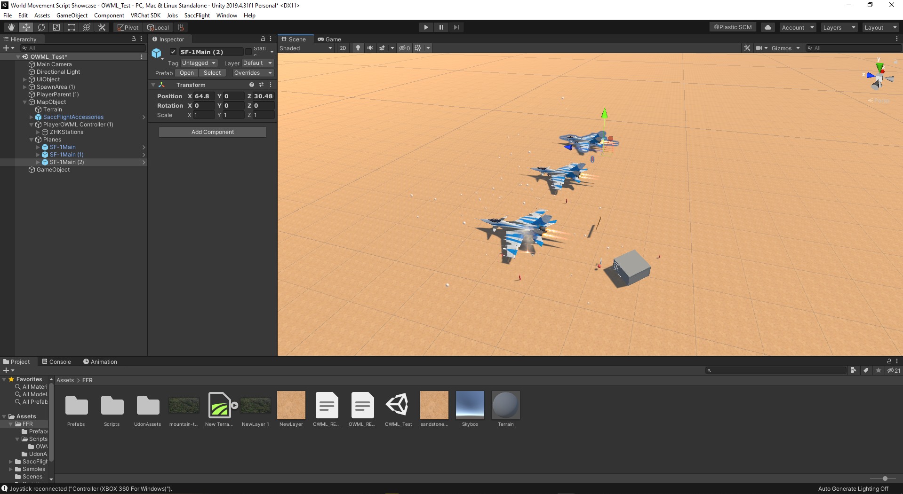
3. Load the prefab into the scene, put it in the root transform and make sure it's placed at Position 0,0,0.
4. Place every aircraft, map objects, and anything that has to be involved in the 'mapObject' or 'map' transform.
	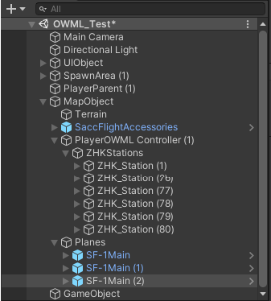
6. Each of the aircraft involved will need these to be configured:

	* Creating the OWMLScript GameObject (ZHK_OpenWorldMovementLogicScript)
		- Create an Empty GameObject at the root of the aircraft object; Name it "OWMLScript". Add a component named "ZHK_OpenWorldMovementLogicScript".
		
			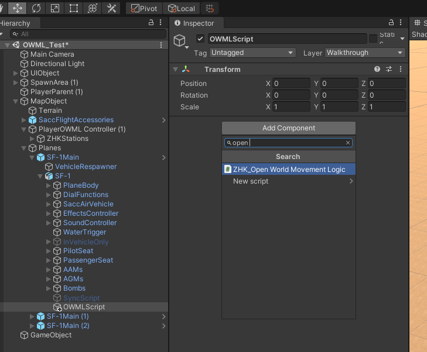
		- Assign Engine Control with your aircraft's SaccAirVehicle Object.
		
			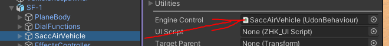
		- Assign UIScript with the scene's UIObject (ZHK_UIScript)
		
			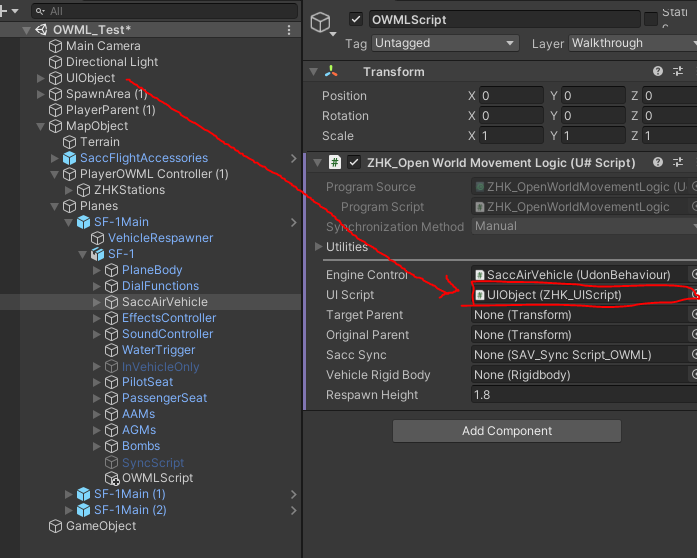
		- Assign Target Parent with the scene's PlayerParent Object based on the prefab or scene.
		
			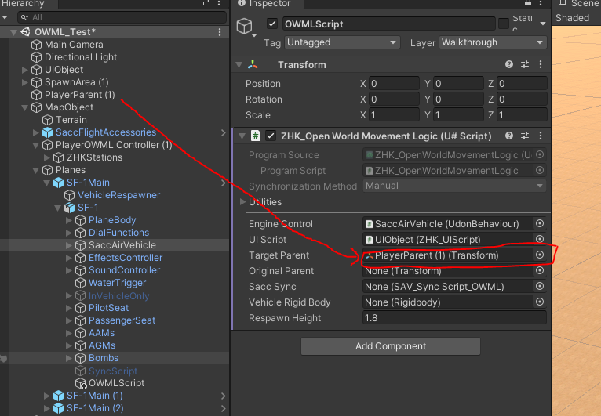
		- Assign Original Parent with the aircraft's Parent Transform Object (The one that is the parent of the SaccEntity / Entity Control.)
		
			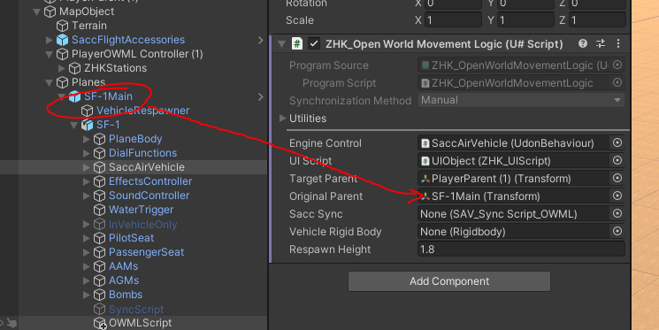
		- Assign Vehicle Rigid Body with the aircraft's Rigidbody Component.
		
			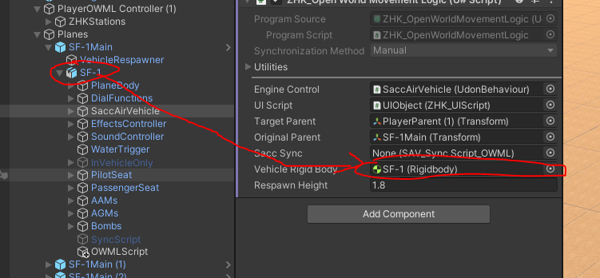
		- Assign the Sacc Sync Object with the SyncScript_OWML that we will be creating after this step.
			
	* Creating the SyncScript_OWML (SAV_SyncScript_OWML)
		- Create an Empty GameObject at the root of the aircraft Object; Name it "SyncScript_OWML". Add a component named "SAV_SyncScript_OWML".
		
			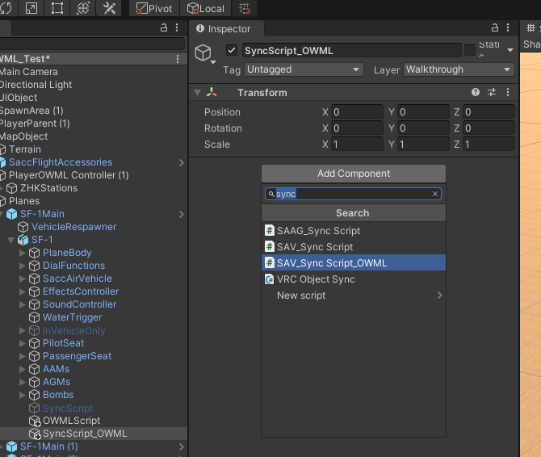
		- Assign the SAV Control. You may follow the existing SyncScript's parameters.
		
			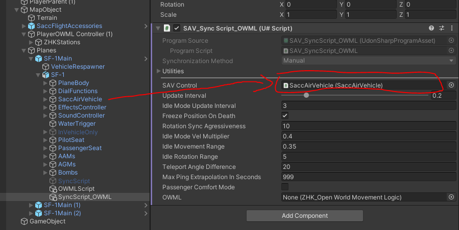
		- Assign the OWML with the created OWMLScript object that we have created earlier.
		
			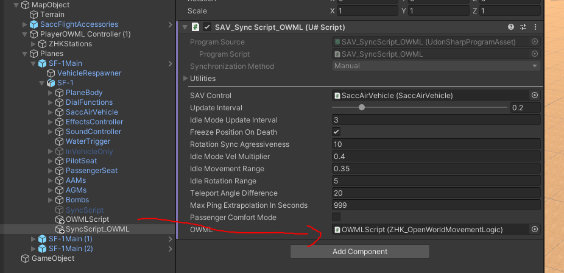
		- Go back to the OWMLScript, assign the Sacc Sync Object with this created SyncScript_OWML.
		
			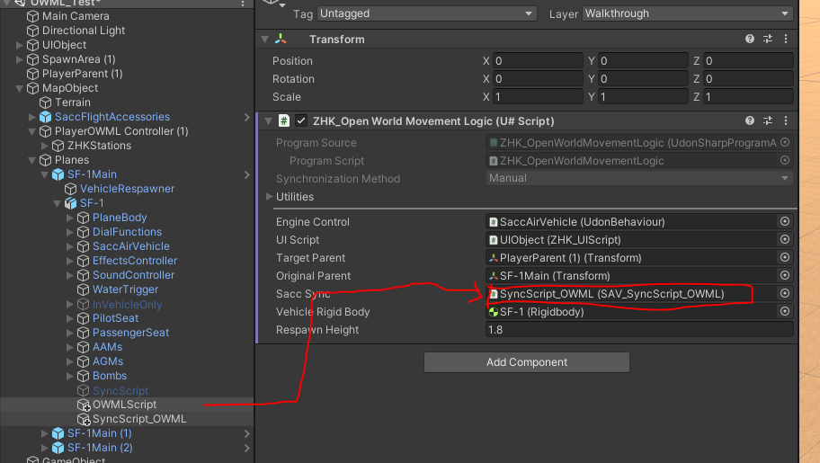

	* Assign and remove necessary and involved UdonBehaviours, Udon Extension Behaviours
		- In the Aircraft object that you are currently modifying, a SyncScript gameobject should already exist (not the SyncScript_OWML we've just created). Disable it.
		
		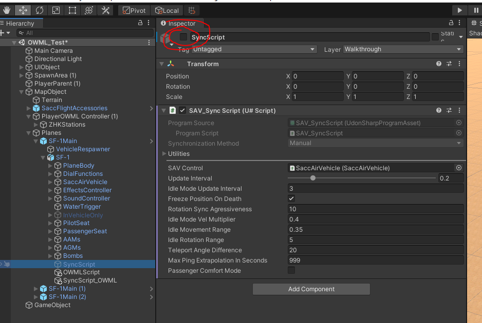
		- Remove the script from the list of Udon Extension Behaviours that is inside the Entity Controller (Parent/Rigidbody of the aircraft)
		- Add the scripts involved in the Udon Extension Behaviours that is inside the Entity Controller. Order is important so do in order:
		    1. SyncScript_OWML
		    2. OWMLScript

	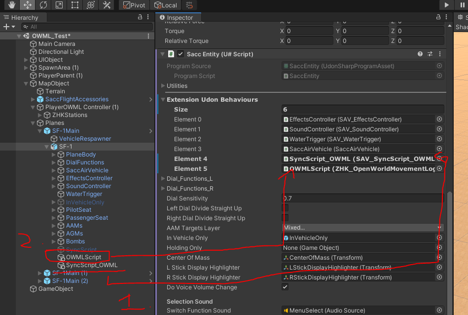

	* Configuring HUDController to use HUDController_OWML
		- Inside your aircraft vehicle, navigate your InVehicleOnly (Or wherever your HUDController is located)
		- Create a gameobject right next to the HUDController (not INSIDE it), name it HUDController_OWML. Add a Component named "HUDController_OWML"
		- Assign HB Old with the old HUDController Object
		- Assign OWML with the OWMLScript that we have created.
		- Leave all the parameters empty; Unless if you are planning to use this as a permanent HUDController.
		
			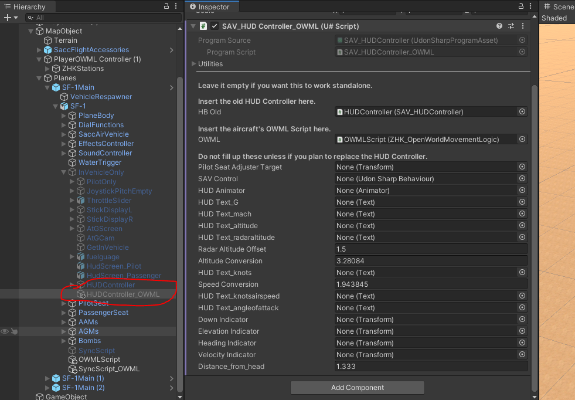
	* Configure each particle systems that uses World Simulation space
	    - Change each ParticleSystem's Simulation space to Custom, and the Custom Simulation Space to the **MapObject**
	    - Names of the particles may as follows
	        - DamageParticles, ExplosionParticles, ExplosionParticlesWater, SmokeTrail (DialFunctions/R/DFUNC_Bomb/Bomb)
	        - DamageParticles, ExplosionParticles, ExplosionParticlesWater, SmokeTrail (DialFunctions/R/DFUNC_AGM/AGM)
	        - DisplaySmoke, HealthSmoke (EffectsController)
	        - Flares, Flares (1) (EffectsController/Flares)
	        - GunParticle_Other, GunParticle_Pilot, GunParticle_Smoke (EffectsController)
	        - Any other ParticleSystem that may need to be inside the MapObject.
	        
		
	* Configure each weapons to use the world space
		- Navigate through your Aircraft/DialFunctions/R/DFUNC_AAM or DFUNC_AGM or DFUNC_Bomb, assign the **World Parent** with the **MapObject**
		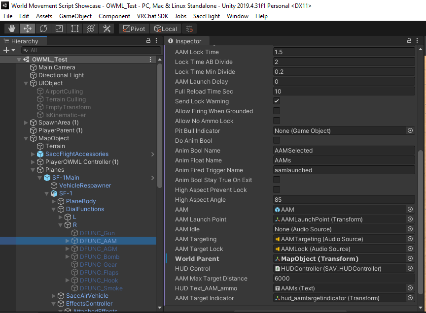
		
		
5. Assign the SyncScripts Involved in the UIScript.
    - You must add every single SyncScript_OWML inside the Sacc Sync List in UIScript.

		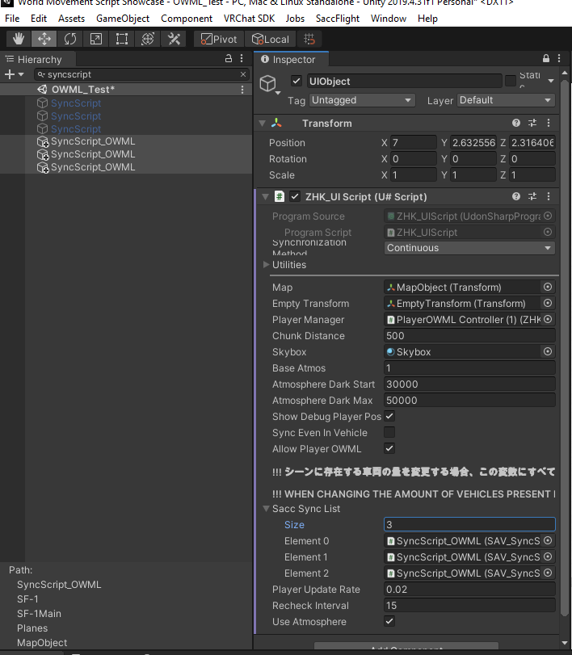
6. Update the VRCSceneDescriptor's respawn height
	- Set the respawn height to a reasonable, ridiculous amount in order to bypass the respawn height. (e.g. 999999)
		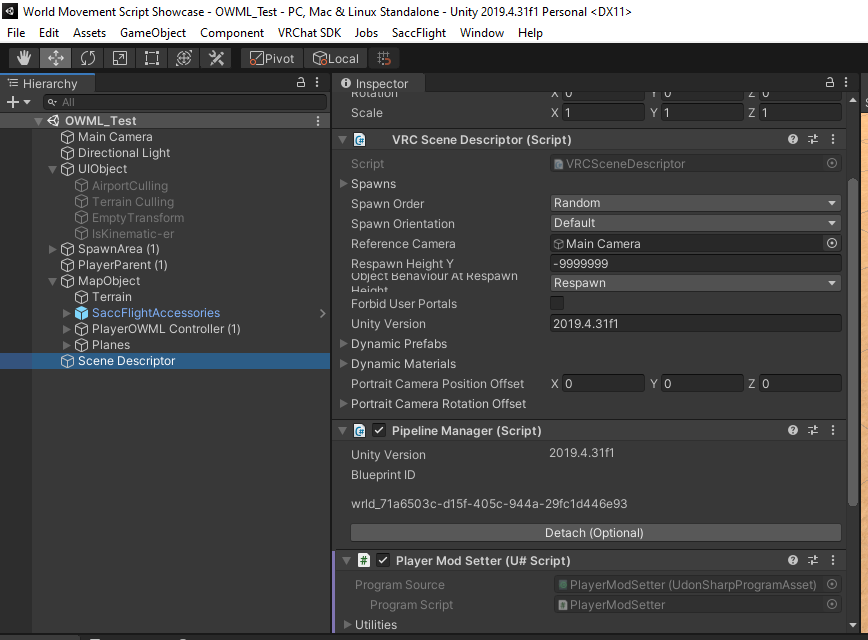
		
7. Set the Spawn area to the same object as ZHK_RespawnHandler
	- Refer to the prefab of the spawn object. Make sure the VRCSceneDescriptor points to that spawn.
	

9. Test. Optimize. Remove any unnecessary objects. 

## Using the Scene

You can use the scene (OWML_Test) as your basis, example or when making the world. When extracting the prefab from it, make sure you assign each aircraft's OWMLScript, SyncScript, UIScript and the Map Object of the UIScript.


## Making from scratch
- Will be documented in the next few releases. For now, please dont.


## FAQ
- Why do i see floating objects from spawn if i fly further?
	- The following may be the reasons why:
	- You may have forgotten to remove 'static' from other gameobjects. Please uncheck Static on these objects. An easy fix would be selecting everything, check static, then uncheck static and apply it for the child objects.
	- These objects may be not under the Map Object. Please put these objects under the Map Object.

- Why are my particles weird whenever i fly further?
	- Please check if these particles' Simulation Space are in **Custom** and if the Custom Simulation Space in the **Map Object**

- Why are my weapons (AAM, AGM, Bombs) acting weird as I fire them and fly further?
	- Please check DFUNC_AAM, DFUNC_AGM, DFUNC_BOMB on your aircrafts and make sure the World Parent is set to **Map Object**

- Why is it still jiggly?
	- Please check whether if the OWMLScript is in the Udon Extension Behaviours list in the Sacc Entity. Make sure that you are not missing any of the required parameters.
	
- Can I implement teleportation?
    - Teleportation is currently experimental at the moment due to the way how the system works. An enhancement script will be provided over time.

- Why is x x x x ?
	- Please contact me via Discord: ZhakamiZhako#2147 or Twitter: @ZZhako 
---
## Notes

**Map** - Contains your 'map'. Make sure you place all your aircraft, terrains, airbases and everything that has to be involved that is part of the 'map' inside.

**PlayerParent** - This will be the target parent object of an aircraft once you've entered in an aircraft. Make sure it is assigned here when you setup OWML from scratch on your aircrafts (as Target Parent)

**PlayerUI** - Insert PlayerUIScript in here. It will be one of the global scripts that will manage your local player.

**Spawn** - Insert the ZHK_PlayerRespawnHandler in here. This will serve as the player's reset trigger when respawning. An important note is this MUST NOT BE INSIDE THE MAP OBJECT as it will alter the player's original spawn coordinates and may cause undesirable results.

---
## Components
The components here below are merely descriptions and a table of 'requirements'. You may not need to reassign some of them (apart from the ZHK_OpenWorldMovementLogic) if you are using the scene or the existing prefab.

**Player UI Script**

|In Prefab?|Required| Item | Description |
|---|---| --- | --- |
|No|Yes|Map|Map object of your world. A lot of scripts reference this variable; make sure you set it or else the entire OWML system will not work.|
|Yes|Yes|Empty Transform|Make an empty gameobject and assign it to this variable; It serves as the 'reference' point for each aircraft in the map when respawning them;
|Yes|Yes|Player Manager|Your Scene's Player Manager Script (PlayerOWML Controller / ZHK_OWML_Player)
|No|Yes|Chunk Distance|Allows you to set the distance for each 'chunk' of the map. Default value is 3000 (meters). Increasing this may result to floating point errors, and reducing it may result to a constant chunk call. Balance it accordingly. 
|No|No|Skybox|Sky settings for procedural skybox. If you don't have procedural skybox, please don't use this
|No|No|Base Atmos|The base value for the atmosphere thinning value. It will be automatically be set as you hit play.
|No|No|Atmosphere Dark Start| Minimum altitude for the atmosphere darkening (For procedural Skybox)
|No|No|Atmosphere Dark Max| Maximum Altitude for the atmosphere darkening (For Procedural Skybox)
|No|No|Show Debug Player Pos| Enabling this will display a gameobject that represents the synchronization of the VRCStations.
|||Sync Even In Vehicle|This will allow synchronization of the players despite being inside the vehicle. May be network expensive. 
|||Allow Player OWML| This will allow the world movement system even when on foot. 
|Yes|Yes|Sacc Sync List| Place every single SyncScript_OWML that is existing in the scene in order to properly update the aircrat list.
|No|No|Player Update rate| The update rate for players to send their position in seconds
|No|No|Recheck Interval| This will be applicable for players joining a little late as an emergency network call to ask the instance owner to have them assign a station.
|No|No|Use Atmosphere| This will enable/disable Sacchan's Atmosphere Thinning on the air vehicles. Either disable this for space vehicles, or include a ridiculous amount on the vehicles themselves.

**ZHK_OpenWorldMovementLogicScript**

|Required| Item | Description |
|---| --- | --- |
|Yes|Engine Control|Assign here your aircraft's Sacc Air vehicle.
|Yes|UI Script|Assign here your scene's UIScript. Otherwise, the script would fail.
|Yes|Target Parent|Assign here your scene's target parent to be assigned when a player enters their aircraft. Preferably use the PlayerParent Object that is provided in the prefab.
|Yes|Original Parent| Assign here your aircraft's original parent (Most likely the parent of your vehicle's rigidbody or SaccEntity)
|Yes|Sacc Sync|Assign here your newly created SyncScript_OWML
|Yes|Vehicle Rigid Body|Assign here your vehicle's rigidbody
|Yes|Respawn Height|Default value is 1.8

**ZHK_OWML_Player**

|In Prefab?|Required| Item | Description |
|---|---| --- | --- |
|Yes|Yes|UI Script| Assign here your scene's UI Script
|Yes|Yes|Stations| Requires 80 objects of ZHK_OWML_Station

**ZHK_OWML_Station**

|In Prefab?|Required| Item | Description |
|---|---| --- | --- |
|Yes|Yes|UI Script|Assign here your scene's UI Script
|Yes|No|Indicator Debug|Assigning an object here and enabling Show Debug Player Pos in UIScript will enable the gameobject assigned in this component.
|Yes|Yes|Station Object|Assign here this gameObject's VRC Station.
|Yes|Yes|OWML_Player|Refers to the scene's Player Manager. 
|||**VRC STATION**
|Yes|Yes|Player Mobility| Set this to mobile.
|Yes|Yes|Can Use Station from station| Set to true.
|Yes|Yes|Disable Station Exit| Set to false.

## Enhancement Components

**ZHK_CullGroup**

This tool allows you to auto disable specific objects according to distance.

|Item| Description |
|---|---|
|Render Distance|Distance from player towards the objects.|
|Cull Angle|Applicable if you want to make objects disabled when they're away from your view. It is a little experimental; set to 180 for all angles. For more advanced culling, use LOD's instead.
|Cull Objects| Objects you want to cull.
|Use For Each|Check through the items every frame. May be expensive.
|Wait Timer|Time before the script starts checking upon loading the world.

**ZHK_IsKinematicGroup**

This tool allows you to auto 'static' aircrafts when you are further away from them. 

|Item| Description |
|---|---|
|Render Distance|Distance from player towards the Rigidbodies
|RigidBodies| Assign here your aircrafts that will be involved with it. |
|Use For Each|Check through the items every frame. May be expensive.
|Wait Timer|Time before the script starts checking upon loading the world.

